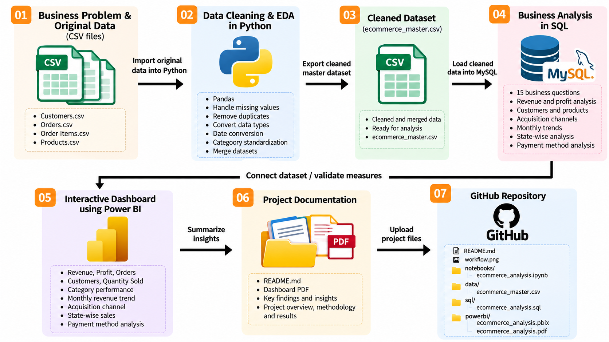
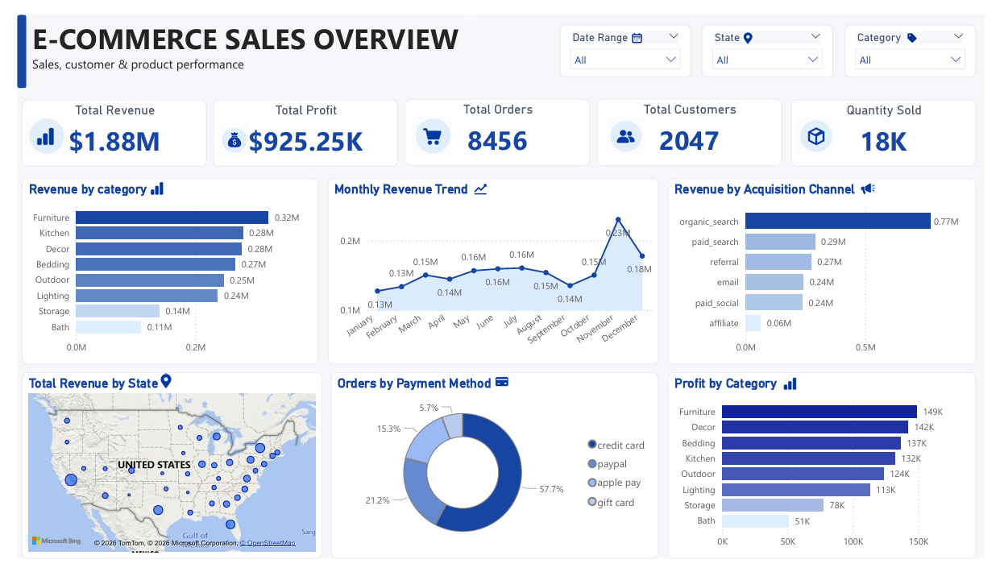

# E-Commerce Sales Analysis | Python, MySQL & Power BI

## 📌 Project Overview

This project focuses on analyzing e-commerce sales data to uncover insights into revenue, profitability, customer purchasing behavior, product performance, and sales trends. Python is used to clean and prepare the original datasets, MySQL is used to answer business questions through SQL queries, and Power BI is used to develop an interactive dashboard for visualizing key performance indicators and business insights.

## Project Workflow

✅ **Data Preparation & Cleaning (Python - Pandas)**
- Imported four original CSV datasets: Customers, Orders, Order Items, and Products.
- Explored dataset structure, variables, and data types.
- Handled missing values and performed data quality checks.
- Removed duplicate records where appropriate.
- Standardized product categories and converted date columns.
- Merged the datasets into a single cleaned master dataset.
- Exported the final dataset for SQL analysis and Power BI reporting.

✅ **Business Analysis (SQL)**
- Loaded the cleaned master dataset into a MySQL database.
- Analyzed top customers based on revenue generation.
- Evaluated monthly revenue trends and month-over-month growth.
- Identified high-performing acquisition channels and states.
- Analyzed product profitability and category-wise revenue contribution.
- Evaluated customer lifetime value and repeat purchasing behavior.
- Compared average order values for paid and free shipping.
- Analyzed cumulative revenue, customer rankings, product combinations, and discount performance.

✅ **Visualization & Insights (Power BI)**
- Developed an interactive e-commerce sales dashboard.
- Created KPI cards for Total Revenue, Total Profit, Total Orders, Total Customers, and Quantity Sold.
- Visualized revenue performance across product categories.
- Analyzed monthly revenue trends.
- Compared revenue across customer acquisition channels.
- Explored state-wise revenue performance.
- Visualized order distribution by payment method.
- Compared profitability across product categories.
- Added interactive slicers for date range, state, and category.

✅ **Report & Presentation**
- Summarized the project workflow, methodology, and key analytical areas.
- Exported the Power BI dashboard as a PDF report.
- Created a project workflow diagram to illustrate the end-to-end analytics process.
- Documented the SQL business questions, dataset structure, and project setup instructions in GitHub.
- Organized the Python notebook, cleaned dataset, SQL scripts, and Power BI files into a structured repository.

## Tools & Technologies

- **Python:** Pandas, data inspection, data cleaning, dataset merging
- **MySQL:** Business analysis queries, aggregation, ranking, window functions, revenue and profit calculations
- **Power BI:** KPI cards, trend analysis, category and channel comparisons, state-level analysis, payment-method visualization
- **GitHub:** Version control and project documentation

## 🚀 Project Execution Steps

## Datasets
- [customers.csv](customers.csv) — Customer information
- [orders.csv](orders.csv) — Order details and order dates
- [order_items.csv](order_items.csv) — Product quantities, prices, costs, and discounts
- [products.csv](products.csv) — Product names, categories, and product information

### 1. Open the Python Notebook
[Python Analysis Notebook](ecommerce_analysis.ipynb)

This notebook contains:

- **Data Import:** Imported the original Customers, Orders, Order Items, and Products CSV datasets.
- **Data Exploration:** Explored dataset structure, column names, data types, and data quality.
- **Data Cleaning:** Handled missing values, removed duplicate records where appropriate, and standardized product categories.
- **Data Transformation:** Converted date columns and prepared the datasets for merging.
- **Dataset Integration:** Merged the four source datasets into a single master dataset.
- **Cleaned Data Export:** Exported the final cleaned dataset as `ecommerce_master.csv` for MySQL business analysis and Power BI dashboard development.

## Cleaned Dataset
The cleaned and merged dataset is stored in the data/processed/ folder.

- [ecommerce_master.csv](ecommerce_master.csv) — Final cleaned master dataset used for SQL business analysis and Power BI reporting.

### 2. Perform SQL Analysis

[SQL Business Analysis Queries](ecommerce_analysis.sql)

This file contains SQL queries used to answer 15 business questions, including:

- **Top Customers by Revenue:** Identified the top 10 customers generating the highest revenue.
- **Monthly Revenue Analysis:** Analyzed monthly revenue trends and month-over-month growth.
- **Acquisition Channel Analysis:** Compared revenue and customer counts across acquisition channels.
- **State-wise Sales Analysis:** Identified states generating the highest sales and revenue.
- **Product Profitability:** Identified the most profitable products and compared profit across categories.
- **Category Revenue Contribution:** Calculated the percentage of total revenue generated by each product category.
- **Customer Lifetime Value:** Evaluated customer revenue contributions.
- **Repeat Customer Analysis:** Measured repeat customers and their revenue contribution.
- **Shipping Type Analysis:** Compared average order values between paid and free shipping orders.
- **Cumulative Revenue Analysis:** Calculated cumulative revenue over time.
- **Customer Revenue Ranking:** Ranked customers based on their revenue generation.
- **Product Purchase Combinations:** Identified products frequently purchased together.
- **Discount Analysis:** Compared revenue from discounted and non-discounted orders.

The SQL analysis uses aggregation, joins, Common Table Expressions (CTEs), window functions, ranking, and conditional logic to generate business insights.

### 3. Open the Power BI Dashboard

[Power BI Dashboard File](ecommerce_analysis.pbix)

The interactive dashboard includes:

- **Sales Performance Overview:** KPI cards displaying Total Revenue, Total Profit, Total Orders, Total Customers, and Quantity Sold.
- **Revenue Analysis:** Analyzed monthly revenue trends to understand sales performance over time.
- **Category Performance:** Compared revenue and profitability across product categories.
- **Acquisition Channel Analysis:** Evaluated revenue generated by different customer acquisition channels.
- **State-wise Sales Analysis:** Visualized revenue distribution across states.
- **Payment Method Analysis:** Examined order distribution by payment method.
- **Interactive Filters:** Added slicers for date range, state, and product category to explore specific segments of the data.

The `.pbix` file can be opened in Power BI Desktop to interact with the dashboard, apply filters, and explore sales and profitability insights. The PDF file provides a static overview of the dashboard.

## 🔬 Methodology
- **Data Cleaning:** Cleaned and merged four CSV datasets using Python and Pandas.
- **SQL Analysis:** Used MySQL to answer 15 business questions about sales, customers, and products.
- **Dashboard Development:** Created an interactive Power BI dashboard to visualize KPIs, revenue trends, and profitability.

## 📊 Key Findings
- Total Revenue: **$1.88M**
- Total Profit: **$925.25K**
- Total Orders: **8,456**
- Total Customers: **2,047**
- Organic search generated the highest revenue (**$0.77M**).
- Furniture recorded the highest category revenue (**$0.32M**).

## 💡 Business Recommendations
- Invest in high-performing acquisition channels, especially organic search.
- Improve sales and profitability in lower-performing product categories.
- Encourage repeat purchases through customer retention strategies.
- Monitor discounts, costs, and profit margins to improve profitability.
- Use monthly sales trends to support inventory and marketing decisions.

## 📊 Dashboard Preview

This project demonstrates an end-to-end analytics workflow: data quality checks and preparation in Python, business-focused querying in MySQL, and interactive reporting in Power BI. It is designed to communicate actionable insights about revenue, profitability, customers, products, and sales channels.
